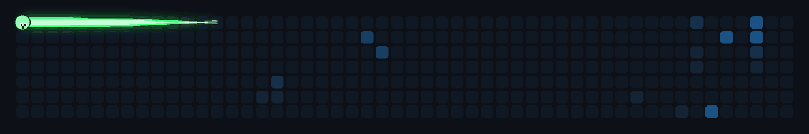

# GitHub Contribution Snake

**Author: maatsuh**

A fully self-contained generator that renders an animated, pixel-art snake
traveling across your GitHub contribution graph. The snake follows a
deterministic serpentine path through every cell of the grid, eats fruits
placed on your contribution cells, and loops forever with a perfectly
seamless loop. The GIF lives inside this repository - no external services.



## Features

- Serpentine route that visits **every** cell of a 52x7 contribution grid
- Natural return to the start (no teleports, no cuts, no camera movement)
- **Perfect infinite loop** - the last frame connects seamlessly with the first
- Neon-green snake with a pixel-art face (eyes, pupils and mouth follow the
  direction of travel), full-cell body segments and a soft green glow
- Pixel-art apples on contribution cells, eaten with a sparkle effect and a
  cell flash; new fruits appear periodically
- Smooth, slow movement with many interpolated frames
- Two data modes: local demo data or your real GitHub contributions (GraphQL)

## Quick start (Windows)

```bat
pip install -r requirements.txt
python scripts\generate_snake.py --demo
```

Open the result in your browser:

```bat
start output\github-snake.gif
```

## Real contributions (GitHub mode)

The default mode fetches your real contributions through the GitHub GraphQL
API. The token is read from the environment - never hardcode it.

```bat
set GITHUB_TOKEN=ghp_your_token
set GITHUB_OWNER=your-username
python scripts\generate_snake.py
```

## GitHub Actions

The included workflow (`.github/workflows/snake.yml`) regenerates the GIF
daily and manually via `workflow_dispatch`. During the run it sets
`GITHUB_TOKEN` and `GITHUB_OWNER` automatically and commits the updated
`output/github-snake.gif`.

## Configuration

All settings are at the top of `scripts/generate_snake.py`:

| Setting            | Default               | Description                                   |
| ------------------ | --------------------- | --------------------------------------------- |
| `CELL_SIZE`        | `20`                  | Cell size in pixels                           |
| `CELL_GAP`         | `4`                   | Gap between cells                             |
| `GRID_ROWS`        | `7`                   | Grid rows (days of the week)                  |
| `GRID_COLS`        | `52`                  | Grid columns (weeks)                          |
| `SNAKE_LENGTH`     | `14`                  | Number of snake segments                      |
| `MOVEMENT_SPEED`   | `1.0`                 | Lower = slower (e.g. `0.4`)                   |
| `FPS`              | `12`                  | Frames per second                             |
| `FRAME_COUNT`      | `0`                   | `0` = auto (keeps the perfect loop)           |
| `GLOW_SIZE`        | `8`                   | Glow blur radius                              |
| `BACKGROUND_COLOR` | `(13, 17, 23)`        | Background color                              |
| `SNAKE_COLOR`      | `(64, 255, 122)`      | Snake body color (neon green)                 |
| `HEAD_COLOR`       | `(148, 255, 180)`     | Snake head color                              |

## Project structure

```
.
├── scripts/
│   └── generate_snake.py
├── output/
│   └── github-snake.gif
├── .github/
│   └── workflows/
│       └── snake.yml
├── requirements.txt
└── README.md
```

---

## License / Credits

**Author:** [maatsuh](https://github.com/maatsuh)